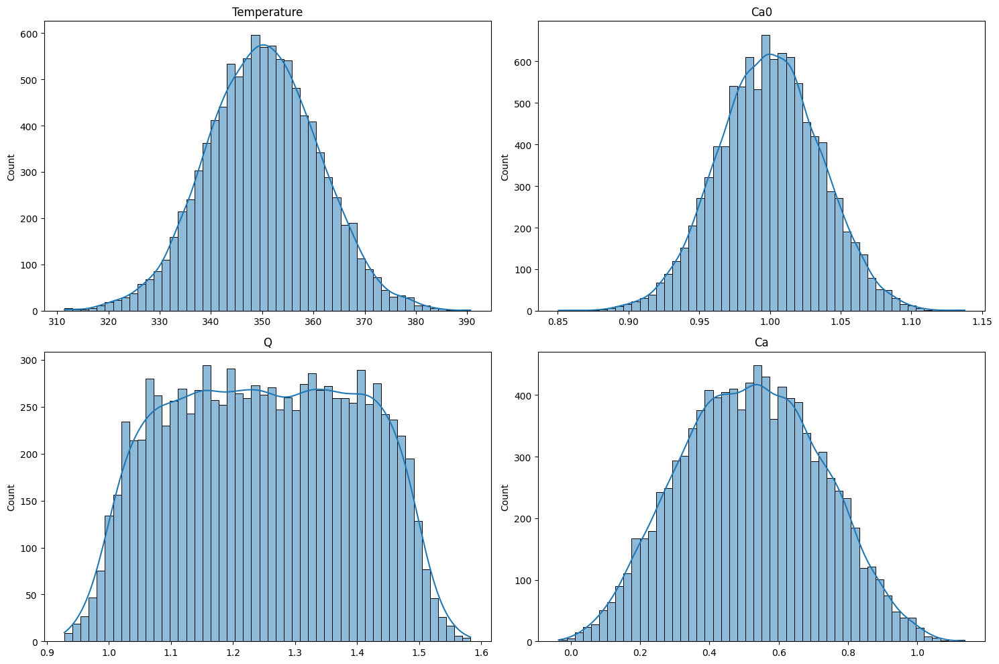
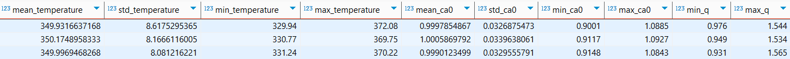
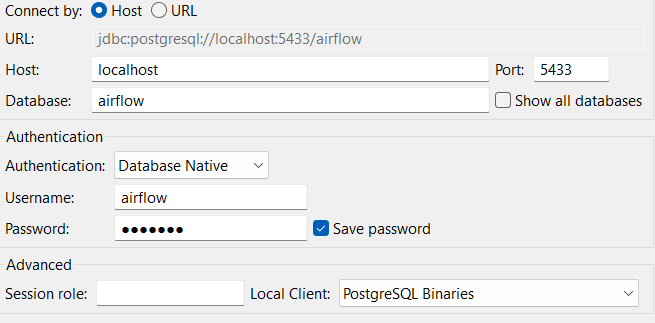

# Anomaly Detection in a CSTR Stream

# Introduction
The goal of this project is to build a simple machine learning pipeline that detects anomalies in a theoretical Continuous Stirred Tank Reactor (CSTR) and automatically logs the reactor data.

The pipeline follows three main steps:

It **generates synthetic sensor data** from the reactor using theoretical chemical formulas.

It **detects anomalies** using both an `Isolation Forest` model and a rule-based decision threshold.

It **stores summary statistics** in a PostgreSQL database for later inspection and reporting.

## Dataset Generation
Synthetic data is generated using theoretical design equations of a Continuous Stirred Tank Reactor (CSTR). To make the sensory data more realistic, Gaussian noise is added to both the input and output variables. Note that the reaction is first order.


$T_i \sim \mathcal{N}(350, 3^2) + \mathcal{N}(0,(\sigma_1 \cdot 350)^2)$

$C_{A0,i} \sim \mathcal{N}(1, 0.02^2) + \mathcal{N}(0, \sigma_1^2)
$

$Q_i \sim \mathcal{U}(1, 1.5) + \mathcal{N}(0, \sigma_1^2)
$

$k_i = A \cdot \exp\left(-\frac{E_a}{R T_i}\right)$

$\tau_i = \frac{V}{Q_i}$

$X_{A,i} = \frac{k_i \tau_i}{1 + k_i \tau_i}$

$C_{A,i} = C_{A0,i} \cdot (1 - X_{A,i})$ 

$r_{A,i} = -k_i \cdot C_{A,i}$

$X_{A,\text{measured},i} = X_{A,i} + \mathcal{N}(0,  \sigma_2^2)$

$C_{A,\text{measured},i} = C_{A,i} + \mathcal{N}(0,  \sigma_2^2)$

$r_{A,\text{measured},i} = r_{A,i} + \mathcal{N}(0,((0.2 \cdot \text{output noise scale})^2))$


On the other hand, anomalies in the sensory data are generated by selectively modifying one of the input variables — either increasing or decreasing its value significantly — while keeping the other variables sampled from their normal distributions:


 

$T_{\text{low},i}: \quad T_i \sim \mathcal{N}(300,3^2) + \mathcal{N}(0,(\sigma_1 \cdot 350)^2) $

$T_{\text{high},i}: \quad T_i \sim \mathcal{N}(400,3^2) + \mathcal{N}(0,(\sigma_1 \cdot 350)^2) $

$C_{A0,\text{low},i}: \quad C_{A0,i} \sim \mathcal{N}(0.01,0.02^2) + \mathcal{N}(0,\sigma_1^2) $
 
$C_{A0,\text{high},i}: \quad C_{A0,i} \sim \mathcal{N}(2,0.02^2) + \mathcal{N}(0,\sigma_1^2) $
 
$Q_{\text{low},i}: \quad Q_i \sim \mathcal{U}(0.2,0.5) + \mathcal{N}(0,\sigma_1^2) $
 
$Q_{\text{high},i}: \quad Q_i \sim \mathcal{U}(2,2.5) + \mathcal{N}(0,\sigma_1^2)$

where $\text{input noise scale} = \sigma_1 = 0.03$ and  $\text{output noise scale} = \sigma_2 = 0.07$.

Follow the steps below to run the project locally using Docker and access the Airflow UI.


## Anomaly Detection

The ideal paramater distribution:



To detect anomalies, the Isolation Forest (IF) algorithm is used. Experimental results show that IF performs well in identifying anomalies in parameters having Gaussian distribution. However, its performance not as good when dealing with uniformly distributed variables, as the clusters in a uniform distribution are harder to separate.

To address this, a simple rule-based threshold is applied to the flow rate (Q). If Q exceeds a predefined upper or lower bound (with a margin), the corresponding sensor reading is classified as an anomaly; otherwise, it is considered normal.

## Data Tracking

The system is configured to evaluate sensory data on an hourly basis. After anomalies are filtered out, both the number of detected anomalies and the summary statistics of the remaining (normal) data are stored in a PostgreSQL database for monitoring and further analysis.



## Setup

Follow the steps below to run the project locally.

### 1. Clone the Repository

Clone the repo by writing the code below to your terminal:

```bash
git clone https://github.com/egonos/Anomaly-Detection-in-a-CSTR-Stream.git
cd Anomaly-Detection-in-a-CSTR-Stream
```
### 2. Start Docker Services

After initializing Docker Desktop, write the following code to your terminal. This will install and initialize the service.

```bash
docker compose up --build
```

### 3. Access Airflow UI

Once the containers are up, open your browser and go to: http://localhost:8080

Login credentials:
* **Username:** egemen
* **Password:** egemen

### 4. Connect Airflow to the Postgres Container

**Note:** This step is only necessary for the first time use.

1. Go to the **Admin** tab → **Connections**.
2. Click '+'
3. Fill the lines accordingly:

* **Connection ID:** sensor_recors
* **Conncection Type:** postgres
* **Host:** postgres
* **Database:** airflow
* **Login:** airflow
* **Port:** 5433 

After that, the installation finishes. You can use or edit the pipeline based on your needs.

## Additional Notes

To monitor the recorded data, you can use a database client such as DBeaver.

1. Go to: **Database -> New Database Connection**
2. Select **PostgreSQL** as the database type.
3. On the connection setup page, provide the required credentials:




**Note:** The password is `airflow` (hidden in the screenshot).

Once the connection is established, you can use SQL queries within DBeaver to explore and analyze the stored data.

Also to anayze the details of the anomaly detection model, please go to `notebooks` folder.

## Further Improvements

This project simulates real-world sensory data using theoretical models and controlled randomness. However, despite my best efforts, the dataset remains synthetic. In real industrial settings, sensor data can be significantly more complex and noisy. As a result, a more advanced machine learning pipeline may be required for robust anomaly detection.
